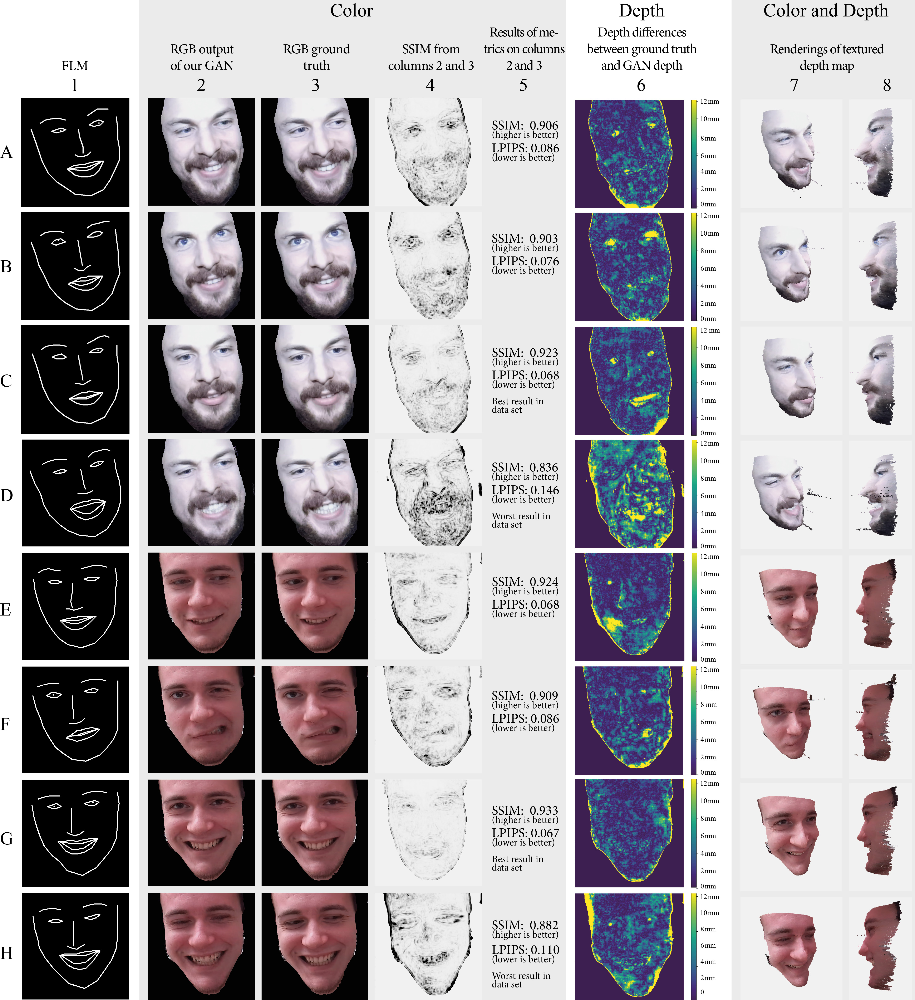
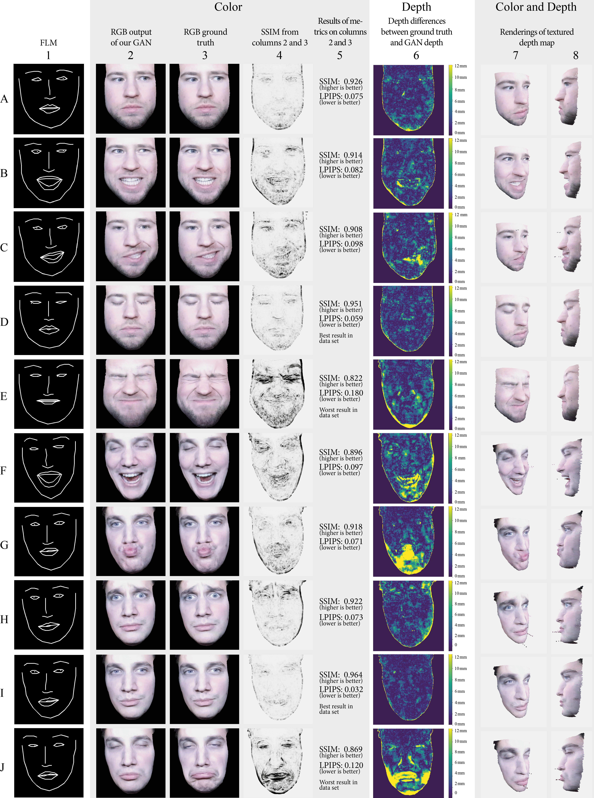

# Face Synthesizer

Paper | [Video](https://youtu.be/fBofqRfvoiM) | [Code](https://github.com/Mirevi/face-synthesizer-JVRB)

This Project is a neural approach to reconstruct a persons 3D-Face as RGBD image from 70 2D landmarks.
The resulting RGBD image can be interpreted as a 2.5D point cloud and thus visualized in 3D applications.
This project is based on the [UCP RGBD-Face-Avatar-GAN Project](https://github.com/Mirevi/UCP-Framework/tree/main/RGBD-Face-Avatar-GAN) by the [MIREVI](https://mirevi.de/) Research Team.

We use the [Pix2Pix-GAN by Isola et al.](https://phillipi.github.io/pix2pix/) as basis for our neural network with some modifications of the loss function from the [Pix2PixHD-GAN by Wang et al.](https://tcwang0509.github.io/pix2pixHD/). The generator remains from the non-HD version in order to generate reasonable framerates for Virtual Reality environments.

# Conference Video:
[Youtube Video](https://youtu.be/fBofqRfvoiM)
<iframe width="560" height="315" src="https://www.youtube.com/embed/fBofqRfvoiM" title="YouTube video player" frameborder="0" allow="accelerometer; autoplay; clipboard-write; encrypted-media; gyroscope; picture-in-picture" allowfullscreen></iframe>


## Requirements

1. Installed Python3 Version
2. OpenCV
3. Nvidia graphics card with CUDA 

## Getting started

Note that the following instructions are for Windows users. Instructions for other operating systems may differ.

1. To setup the project first clone it into your desired location on your computer.
2. Next open your command line interface and navigate into the root directory of the project.
3. After that create a Python Virtual Environment by executing the following command in the CMI: `python -m venv .venv`
4. Now you need to install the required python dependencies by running the following commands:
	1. Install Cython and cmake via pip install
	2. Download and install Azure Kinect SDK (tested with v1.4.1 - [click](https://github.com/microsoft/Azure-Kinect-Sensor-SDK/blob/develop/docs/usage.md)) 
	3. Add to PATH: 
	   a. C:\Program Files\Azure Kinect SDK v1.4.1\sdk\include
	   b. C:\Program Files\Azure Kinect SDK v1.4.1\sdk\windows-desktop\amd64\release\lib
    4. `".venv/Scripts/pip.exe" install torch==<YOUR_TORCH_VERSION>+cu<YOUR_CUDA_VERSION> torchvision==<YOUR_TORCHVISION_VERSION>+cu<YOUR_CUDA_VERSION> -f https://download.pytorch.org/whl/torch_stable.html`
    5. `".venv/Scripts/pip.exe" install pyk4a --no-use-pep517 --global-option=build_ext`
    6. `".venv/Scripts/pip.exe" install -r requirements.txt`

Note that the <YOUR_TORCH_VERSION>, <YOUR_CUDA_VERSION> and <YOUR_TORCHVISION_VERSION> are refering to your individual project specific settings.
We used Torch version 1.8.1 with CUDA 11.1 and Torchvision 0.9.1 on RTX2080, RTX2080 Ti and RTX3090 graphics card with Intel i7 and i9 CPUs.

## Create a dataset for training
In order to be able to train a neural model, a dataset with RGB images, Depth images and Facial Landmarks is required.
The generation of this dataset is divided into two steps.
First capture image data with an Azure Kinect Camera and the process the captured data and create the dataset.

In Summer 2022 a capture module will be implemented into our Mirevi Motion Hub (https://github.com/Mirevi/MotionHub) for an guided an easy capture, preprocessing and training process. In the meanwhile, we provide a bunch of python scripts for these steps. 

We can provide data sets (around 6GB of size each) if you contact us. Please see the mail addresses in the paper

### Capture image data
For our experiments we built a wooden helmet mount as shown in the paper. In order to replace the mount for test purposes we created a pipeline that works without helmet mount by real-time face tracking and head rotation determination.
For capturing the (unprocessed) dataset run the following command from the root directory of the project:
```
"./.venv/Scripts/python.exe" ./capture_data.py --name new_data --train_image_amount 1500 --eval_image_amount 250 --overwrite --visualize
```
It will start a capture process via an Azure Kinect Camera with a visualization window.
You may turn the visualization window off because of the terrible performance while visualizing. For this you simply need to remove `--visualize`.
The result of the capture is an unprocessed dataset containing 1750 RGB-,depth- and infrared images and is located in the `datasets\unprocessed\new_data` directory.
1500 Images of the 1750 are training images, the rest is for evaluation.
You can also use the capture_data batch script which is located in the scripts subfolder.

### Convert unprocessed dataset
To convert the unprocessed dataset into the required processed dataset run the following command:
```
"./.venv/Scripts/python.exe" ./convert_data.py --name new_data --face_depth 80 --overwrite
```
This process may take a while (in some cases several days) because of the underlying depth filling algorithm which fills holes in the depth image from the Azure Kinect.
If you dont want to wait that long you can turn the depth filling off by adding this argument: `--no_depth_filling`.
Otherwise you can also interrupt the process and continue it later if you replace the `--overwrite` with the `--continue_process` argument.
The resulting processed dataset is located here: `datasets\processed\new_data`.

## Train a neural model
To train a model you simply have to run the following commands.
For live visualization of training data in a browser we use a visdom server. You can start the server by simply running `"./.venv/Scripts/visdom.exe"`.
If you dont want a live visualization you can turn it off by adding the `--no_visdom` argument to the following command.
``` 
"./.venv/Scripts/python.exe" -m train --dataset_name new_data --name new_model --n_epochs 30 --n_epochs_decay 70 --netD multiscale --use_gan_feat_loss --use_lpips_loss --lambda_lpips 10 
```
Note that there are several settings for a training process but we got the best results with using the above settings.
Your trained dataset is located here: `checkpoints\new_data`.
The trained neural model is stored as .pth file and as tracedGenerator.zip file.

## Results


